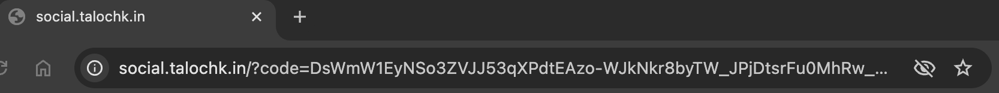

# Getting Started
0. Set app.authorization-server.google.client-secret & app.authorization-server.google.client-id
1. Run project: mvn spring-boot:run
2. Call localhost:8080/oauth2/authorize?client_id=stateless-social&response_type=code&response_mode=query&provider=google&redirect_uri=https://social.talochk.in
3. You'll be landed on the non-existing resource, which could be e.g. your PWA application!
4. 
5. Copy Code parameter value.
6. Exchange code to the Access&Refresh tokens, using the Postman collection request.

